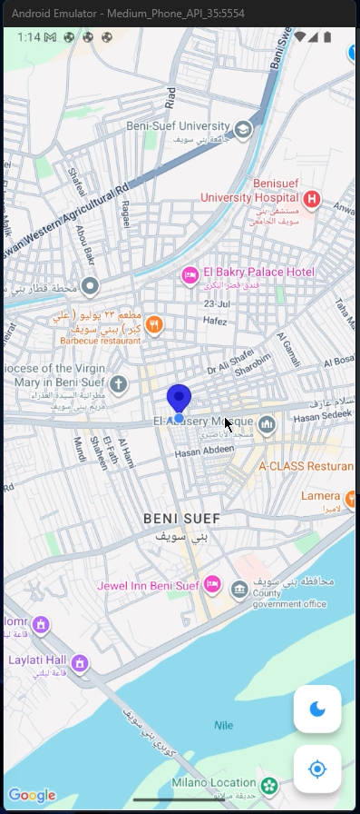
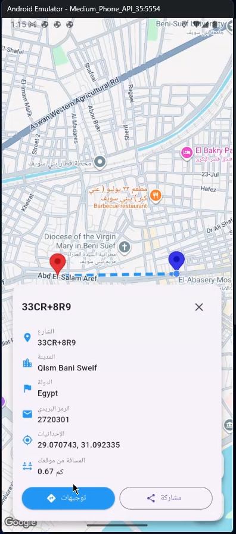
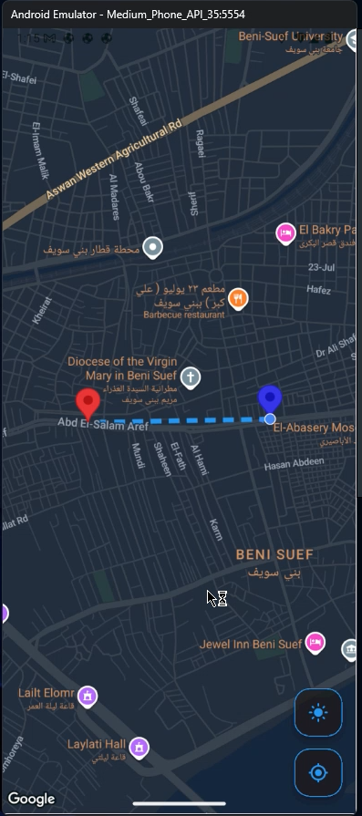

# location_test

A new Flutter project.

## Getting Started

This project is a starting point for a Flutter application.

A few resources to get you started if this is your first Flutter project:

- [Lab: Write your first Flutter app](https://docs.flutter.dev/get-started/codelab)
- [Cookbook: Useful Flutter samples](https://docs.flutter.dev/cookbook)

For help getting started with Flutter development, view the
[online documentation](https://docs.flutter.dev/), which offers tutorials,
samples, guidance on mobile development, and a full API reference.


# 📍 Flutter Google Maps Mini App

تطبيق فلاتر تجريبي (Mini App) يستعرض كيفية دمج خرائط جوجل وتتبع الموقع ورسم المسارات بين النقاط، مع دعم كامل للوضعين الليلي والنهاري.

## 🚀 المميزات (Features)

* **تحديد الموقع الحالي:** جلب إحداثيات المستخدم بدقة عالية.
* **رسم المسارات (Polylines):** حساب ورسم الطريق بين نقطتين (المصدر والوجهة).
* **تحويل الإحداثيات (Geocoding):** عرض اسم المنطقة، المدينة، والرمز البريدي بناءً على الموقع.
* **حساب المسافات:** عرض المسافة بالكيلومتر بين موقعين.
* **دعم الثيمات:** تبديل تلقائي بين واجهة الخريطة العادية (Light) والداكنة (Dark).

---

## 📸 بعض شاشات التطبيق (Screenshots)

| تفاصيل الموقع | الواجهة النهارية | الواجهة الليلية |
| :---: | :---: | :---: |
|  |  |  |

> **ملاحظة:** يرجى تغيير أسماء ملفات الصور في الكود أعلاه لتطابق الأسماء الموجودة في مجلد `screenshots` بمشروعك.

---

## 🛠 الحزم المستخدمة (Dependencies)

تم استخدام الحزم التالية مع روابط التوثيق الرسمية لكل منها:

* **[google_maps_flutter: ^2.14.0](https://pub.dev/packages/google_maps_flutter)** - العرض الأساسي للخريطة.
* **[flutter_polyline_points: ^3.1.0](https://pub.dev/packages/flutter_polyline_points)** - لرسم الخطوط بين الإحداثيات.
* **[geolocator: ^14.0.2](https://pub.dev/packages/geolocator)** - الوصول لخدمات الـ GPS.
* **[geocoding: ^4.0.0](https://pub.dev/packages/geocoding)** - تحويل الإحداثيات إلى عناوين نصية.
* **[permission_handler: ^12.0.1](https://pub.dev/packages/permission_handler)** - إدارة صلاحيات التطبيق.
* **[internet_connection_checker_plus: ^2.9.1+1](https://pub.dev/packages/internet_connection_checker_plus)** - فحص الاتصال بالشبكة.
* **[http: ^1.6.0](https://pub.dev/packages/http)** - لعمل طلبات API لخرائط جوجل.

---

## ⚙️ متطلبات التشغيل (Setup)

1.  قم بالحصول على **Google Maps API Key** من [Google Cloud Console](https://console.cloud.google.com/).
2.  أضف المفتاح في ملف `AndroidManifest.xml` (للأندرويد) وفي `AppDelegate.swift` (للـ iOS).
3.  قم بتشغيل الأمر التالي لتحميل المكتبات:
    ```bash
    flutter pub get
    ```
4.  قم بتشغيل المشروع:
    ```bash
    flutter run
    ```

---

## 👨‍💻 المساهمة
إذا كان لديك أي تعديل أو تحسين، لا تتردد في عمل Pull Request!
